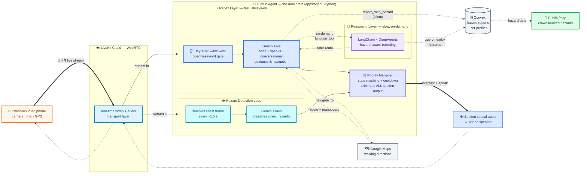

# 🦾 Tuntun.In

> **A mobility companion that gives a chest-mounted phone the eyes and voice
> of a trusted guide** — for visually impaired pedestrians in Indonesia.

A smartphone worn on the chest streams its live camera and microphone to a
cloud AI "agent" that watches the road, speaks instant spatial warnings
about Indonesian street hazards (parked motorcycles, open manholes,
potholes, drainage gutters), guides navigation, and silently maps damaged
infrastructure for other blind users.

Built with **Next.js · LiveKit · Gemini Live · Convex · Better-Auth**.

## Features

1. **Reflex AI — real-time vision-to-audio** (core): the Reflex Layer (Gemini
   Live) watches the chest-camera feed and speaks instant spatial warnings for
   Indonesian street obstacles — parked motorcycles on sidewalks, open
   manholes, potholes, drainage gutters, low banners, excavation pits.
2. **Deep Navigator — macro-to-micro navigation** (core): the `navigate_to`
   tool fetches a walking route from Google Maps, then the Reflex Layer grounds
   each maneuver in what the camera actually shows ("turn left just past the
   blue food cart" instead of "turn left in 50 meters"). Uses a return-fast +
   background-task + follow-up reply pattern so the user never hears dead air
   while the route is being fetched.
3. **Live Crowdsourced Mapping** (core): the `report_road_hazard` tool
   silently snapshots the camera + GPS and stores damaged-infrastructure
   reports (image + coordinates + description) in Convex. No spoken
   confirmation — the user is never interrupted. A public `/map` dashboard
   renders every report so other blind users can avoid known bad road/sidewalk.
5. **Transit Spotter — contextual OCR** (optional, not implemented).

## Architecture — dual brain

The agent is split into two layers, mirroring the human nervous system: a
fast always-on reflex (spinal cord) and a slow on-demand reasoner (cortex).



#### Color legend

| Color | Role |
|---|---|
| 🟧 amber | The user's phone — physical input (camera, mic, GPS) |
| 🟦 light blue | LiveKit Cloud — WebRTC video + audio transport |
| 🔵 blue | **Reflex Layer** — fast, always-on vision + voice (Gemini Live) |
| 🩵 cyan | **Hazard Detection Loop** — continuous perception (Gemini Flash) |
| 🟣 indigo (thick) | **Priority Manager** — arbitrates *all* spoken output |
| 🟪 violet | **Reasoning Layer** — slow, on-demand route planning (DeepAgents) |
| ⬜ slate | External services (Google Maps, Convex) |
| 🟩 green | Crowdsourced public `/map` — hazard data for other blind users |

> **Arrow types:** solid `→` = live media stream, thick `==>` = primary
> spoken output, dashed `-.->` = on-demand tool calls / data queries.

### How it works (in plain English)

Tuntun.In turns a phone into a pair of smart eyes and ears, worn on the
chest. Three things happen at once:

1. **It watches** — a fast, always-on AI (the *Reflex Layer*) sees the road
   through the camera and, in under a second, speaks warnings out loud:
   *"manhole ahead, step right."*
2. **It thinks** — a slower, on-demand AI (the *Reasoning Layer*) plans
   walking routes that steer around known hazards, but only when asked.
3. **It maps** — every hazard it spots is quietly logged to a shared public
   map so other blind pedestrians can avoid the same bad road.

> Think of it as a nervous system: a fast **spinal-cord reflex** for instant
> danger, and a slow **cortex** for route planning — never blocking the
> safety-critical path.

**Two trigger sources, one output channel.** Reactive conversation opens via
the "Hey Tutu" wake word (`turn_detection="manual"` — the agent ignores
ambient speech). Proactive hazard warnings come from the separate Hazard
Detection Loop and bypass the wake gate entirely. Both converge on one audio
output, so the **Priority Manager** arbitrates:

| Priority | Behavior |
|---|---|
| CRITICAL | `interrupt()` + speak warning immediately — always preempts any speech or conversation. |
| MODERATE | Wait for the current speech to finish, then interrupt + speak. |
| LOW | Speak only if the agent is idle; otherwise skip (not time-critical). |

Each hazard is keyed by description with a 5-second cooldown, so the same
hazard is not repeated while different hazards can still stack.

**Why split reflex from reasoning.** Putting perception and multi-step
reasoning in one model makes every response slow and expensive — but hazard
warnings need sub-second reaction. The Reflex Layer (Gemini Live) stays fast
and always on; the Reasoning Layer (LangChain + DeepAgents) is invoked only
on demand via a `function_tool` for the one case that needs real thinking —
finding a safer route that avoids known crowdsourced hazards. It is allowed to
take a few seconds and is never on the safety-critical hot path.

## Repo layout

```
apps/
  web/      Next.js client — Reflex call, public hazard map, dashboard
  agent/    Python LiveKit agent (the dual-brain above)
packages/
  backend/  Convex schema + queries/mutations (hazards, profiles, auth)
  ui/       Shared shadcn/ui primitives
  config, env
```

## Agent modules (`apps/agent/src/tuntun_agent`)

- `agent.py` — `TuntunAgent` (Reflex Layer) + the four `function_tool`s.
- `wakeword.py` — "Hey Tutu" openwakeword ONNX detector; reactive conversation only.
- `hazard_loop.py` — separate perception loop; classifies frames → Priority Manager.
- `priority.py` — state machine + 3-level interrupt policy + per-hazard cooldown.
- `navigator.py` — Google Maps geocode/directions + landmark-grounded guidance.
- `reasoning.py` — LangChain/DeepAgents detour reasoning (queries `hazardAgent:listNearby`).
- `crowdsource.py` — silent hazard report (frame → JPEG → Convex file storage → row).
- `events.py` — verbose LiveKit event logging + GPS/profile data-channel handlers + frame buffer.
- `convex.py`, `logging_setup.py` — shared helpers.

## Convex schema (`packages/backend/convex/schema.ts`)

Two tables matching the demoed features: `userProfiles` and `hazardReports`
(crowdsourced map). Agent-facing mutations/queries (`hazardAgent:*`,
`agent:*`) are gated by `CONVEX_SERVICE_SECRET` — the agent has no user
session. `hazard:listReports` is public (the `/map` dashboard);
`hazardAgent:listNearby` powers the detour reasoning layer.

## Getting started

Install dependencies:

```bash
pnpm install
```

Convex setup:

```bash
pnpm run dev:setup
```

Follow the prompts to create a Convex project, then copy env from
`packages/backend/.env.local` into `apps/*/.env`. The Python agent reads its
own env from `apps/agent/.env` (see `apps/agent/.env.example`):
`LIVEKIT_URL`, `LIVEKIT_API_KEY`, `LIVEKIT_API_SECRET`, `GOOGLE_API_KEY`,
`GOOGLE_MAPS_API_KEY`, `CONVEX_URL`, `CONVEX_SERVICE_SECRET`,
`PUBLIC_WEB_URL`.

Run everything:

```bash
pnpm run dev          # web + convex + agent
pnpm run dev:web      # web only
pnpm run dev:agent    # python agent only
```

Web app: [http://localhost:3001](http://localhost:3001).

## Quality

- Python agent: `cd apps/agent && .venv/bin/ruff check src/`
- TypeScript / formatting: `pnpm dlx ultracite fix` (Biome), `pnpm run check-types`
- Convex typecheck: `cd packages/backend && pnpm convex codegen`

## Deployment

- **Docker Compose** — `pnpm run docker:build` / `docker:up` / `docker:logs`
  / `docker:down`. Config in `docker-compose.yml`; app Dockerfiles in
  `apps/*/Dockerfile`. Env read from each app's `.env`, overridden for
  container networking in `docker-compose.yml`.
- **Railway** — `apps/web` and `apps/agent` each ship a
  `railway.json`; both auto-deploy from their GitHub service
  source. See `.claude` memory notes for the wiring.

## UI customization

Shared shadcn/ui primitives live in `packages/ui`. Change design tokens in
`packages/ui/src/styles/globals.css`, primitives in
`packages/ui/src/components/*`, aliases in `packages/ui/components.json` and
`apps/web/components.json`. Add shared primitives:

```bash
npx shadcn@latest add accordion dialog popover -c packages/ui
```

Import: `import { Button } from "@tuntun-in/ui/components/button";`

## Available scripts

- `pnpm run dev` — start all apps in dev mode
- `pnpm run build` — build all apps
- `pnpm run dev:web` / `dev:agent` / `dev:server` — start one app
- `pnpm run dev:setup` — set up + connect Convex
- `pnpm run check-types` — TypeScript across all apps
- `pnpm run docker:build` / `docker:up` / `docker:logs` / `docker:down`
